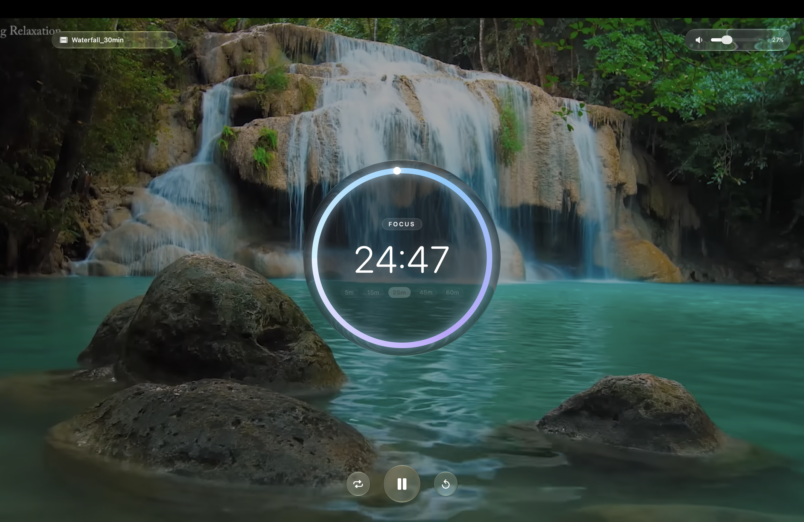

# Fokus

A minimalist, high-aesthetic focus timer for macOS featuring a native Glass UI (liquid translucency and specular highlights), seamless looped background videos, circular progress countdowns, and full-screen immersion.

<p align="center">
  
</p>

---

## ✨ Features

- **Native Glass UI**: Frameless window with `.ultraThinMaterial`, specular edge highlights, and hidden titlebar.
- **Looped Video Background**: Seamless gapless video playback with directory loading, cycling, and drag-and-drop.
- **Circular Focus Timer**: Glowing progress ring, wall-clock accuracy, and quick duration presets (5m–60m).
- **Essential Controls**: Play/Pause, Stop/Reset, Repeat mode, and ambient video volume slider.
- **Native Fullscreen**: Expands cleanly to fullscreen with aspect-fill video scaling.

---

## 🎬 How to Load Background Videos

You can load background videos using any of the following methods:

1. **Top Bar Button**: Click the glass pill labeled **"Load Video or Folder"** in the top toolbar to choose either a single video file or an entire directory.
2. **Keyboard Shortcut**: Press **`⌘O`** (`Command + O`) anywhere in the app to open the file chooser.
3. **Drag & Drop**: Drag any `.mp4`, `.mov`, `.m4v`, or folder of videos directly from **Finder** into the app window.

Supported formats: `.mp4`, `.mov`, `.m4v`, `.webm`, `.avi`.

---

## ⌨️ Keyboard Shortcuts

| Shortcut | Action |
| :--- | :--- |
| **`Space`** | Play / Pause Timer |
| **`⌘O`** | Open Video or Folder Dialog |
| **`⌘W`** / **`X Button`** | Close and Quit App |
| **`⌃⌘F`** | Toggle Fullscreen Mode |

---

## 📂 Project Architecture

```
Fokus/
├── Fokus/
│   ├── MyApp.swift               # Application entry point, window styling, and AppDelegate lifecycle
│   ├── ContentView.swift         # Main layout assembling background video, timer ring, controls, and toolbar
│   ├── TimerModel.swift          # Wall-clock timer engine, repeat logic, presets, and audio alert
│   ├── LoopedVideoPlayer.swift   # AVPlayerLooper integration, directory scanner, and AppKit AVPlayerLayer
│   ├── GlassComponents.swift     # Glassmorphic modifiers, circular progress ring, button styles, and volume slider
│   └── Assets.xcassets           # App icons and asset catalog
├── Fokus.xcodeproj               # Xcode project configuration
└── README.md                     # Project documentation
```

---

## 🛠️ Requirements & Building

### Requirements
- macOS 14.0 or later
- Xcode 15.0 or later / Command Line Tools
- Swift 5.9+ (Swift 6 compatible)

### Building from Xcode
1. Open `Fokus.xcodeproj` in Xcode.
2. Select the `Fokus` target and choose **My Mac** as the run destination.
3. Press `Cmd + R` to build and run.

### Building via Terminal
```bash
# Build the app with ad-hoc signing
xcodebuild -scheme Fokus \
  -destination 'platform=macOS' \
  -derivedDataPath ./DerivedData \
  CODE_SIGN_IDENTITY="-" \
  CODE_SIGNING_REQUIRED=NO \
  build

# Launch the compiled app
open ./DerivedData/Build/Products/Debug/Fokus.app
```

---

## 📄 License

This project is licensed under the MIT License - see the LICENSE file for details.
